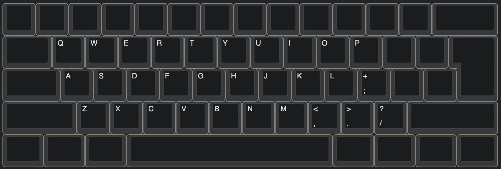
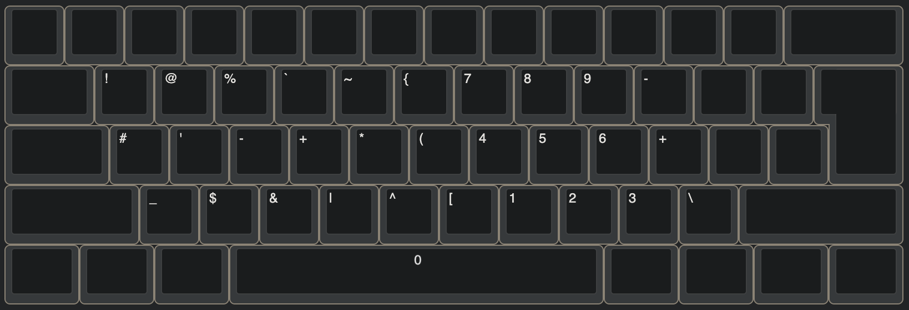
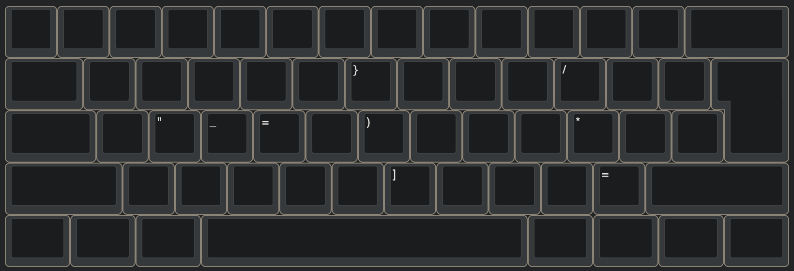

# my-karabiner-elements

## 環境

macOS(JIS配列)

## 使い方

1. `~/.config/karabiner/assets/complex_modificaions/`にjsonファイルを置く
2. Karabiner-Elements.app を開いてcomplex modifications から有効化する

## ファイル

- `emacs_keybindings.json`: Emacsのキーバインド関係の設定．基本的にはEmacsの操作と普通の操作のズレ(Ctrl+m と Enter のズレなど)を補正する．
- `meh_and_hyper.json`: Mehキー(Ctrl + Option + Shift), Hyperキー(Cntl + Option + Shift + Command)を使って数字と記号を打つ用のレイヤーを実装する．

## レイアウト

通常時

Mehキー有効時

Hyperキー有効時

