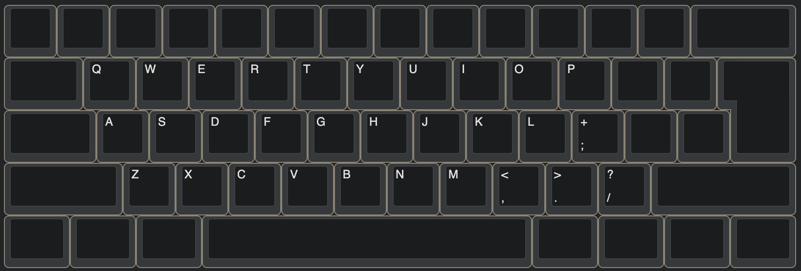
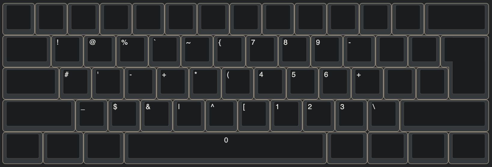
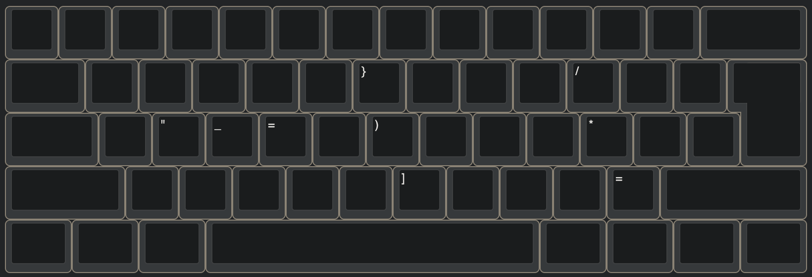

# my-karabiner-elements

## 環境

macOS(JIS配列)

## 使い方

1. `~/.config/karabiner/assets/complex_modificaions/`にjsonファイルを置く
2. Karabiner-Elements.app を開いてcomplex modifications から有効化する

## ファイル

- `emacs_keybindings.json`: Emacsのキーバインド関係の設定．基本的にはEmacsの操作と普通の操作のズレ(Ctrl+m と Enter のズレなど)を補正する．
- `meh_and_hyper.json`: Mehキー(Ctrl + Option + Shift), Hyperキー(Cntl + Option + Shift + Command)を使って数字と記号を打つ用のレイヤーを実装する．

## キー動作の説明

### `emacs_keybindings.json`

- `Space`：長押しで `Left Control`、単押しで `Space`
- `Left Control`：長押しで `Left Control`、単押しで `Esc`
- `Ctrl+y` → `Cmd+v`（貼り付け）
- `Ctrl+w` → `Cmd+c`（コピー）
- `Ctrl+i` → `Tab`
- `Ctrl+m` → `Enter`
- `Ctrl+h` → `Backspace`
- `Ctrl+b` / `Ctrl+f` / `Ctrl+p` / `Ctrl+n` → ← / → / ↑ / ↓
- `Ctrl+/` → `Cmd+z`（Undo）

### `meh_and_hyper.json`

#### レイヤーキー

- `Caps Lock` → Meh（`Right Ctrl + Right Option + Right Shift`）
- `英数`：長押しで `Left Command`、単押しで `英数`
- `かな`：長押しで Meh、単押しで `かな`
- 同時押し：`J+K` と `D+F` で Meh、`K+L` と `S+D` で Hyper
  - Hyper = Meh + `Right Command`

#### Meh/Hyperレイヤーでの文字・記号入力

長いので [レイアウト](##レイアウト) に記載。

## レイアウト

通常時

Mehキー有効時

Hyperキー有効時

